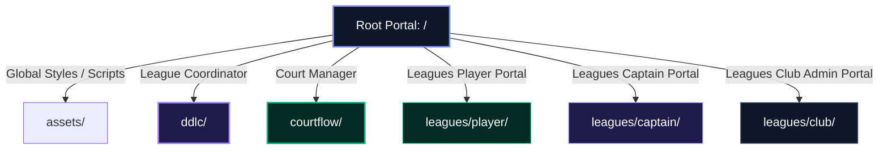

# Master Architecture Documentation

This document establishes the structural rules, domain boundaries, design tokens, and technical history of the FixtureFlow brand portal and marketing monorepo.

---

## 🧭 1. Repository Domain Taxonomy

This repository operates as a multi-domain portal split into distinct directory roles:



### 1.1 Directory Roles & Paths
*   **Root Namespace (`/`):** Brand landing portal and traffic router.
*   **Court Queue Manager Namespace (`/courtflow/`):** CourtFlow play coordinator and waitlist pages.
*   **Dynamic PWA Shell Wrapper Namespace (`/courtflow/play/`):** Full-screen iframe container executing the CourtFlow rotation matching software.
*   **Leagues Player Portal Namespace (`/leagues/player/`):** Standalone PWA wrapper for active players checking standings and queues.
*   **Leagues Captain Portal Namespace (`/leagues/captain/`):** Standalone PWA wrapper for captains managing rosters and scores.
*   **Leagues Club Admin Portal Namespace (`/leagues/club/`):** Standalone PWA wrapper for club secretaries managing settings.
*   **Global Assets (`/assets/`):** Houses shared assets, design tokens (`/assets/css/style.css`), logos, and page navigation scripts.

---

## 🎨 2. Design System & Domain Branding

FixtureFlow uses **Sovereign Glassmorphism**: a visual aesthetic featuring dark obsidian modes, translucent glass containers (`backdrop-filter: blur(16px)`), low-opacity thin borders (`rgba(255, 255, 255, 0.08)`), and soft radial neon background glows.

### 2.1 Color Tokens & Domain Mappings
Accents align with the functional domain of the portal:

1. **🟣 Electric Violet (`#a78bfa` / `#6d28d9`) - The "Organization" Domain**
   * *Purpose*: Scheduling, team roster submissions, and fixture coordination.
   * *Active in*: Leagues Captain Portal, Leagues Hero Section.
2. **🟢 Vibrant Mint & Emerald (`#10b981` / `#047857`) - The "Active Play" Domain**
   * *Purpose*: Live court queue rotation, player standing check-ins, and active session play.
   * *Active in*: CourtFlow App, Leagues Player Portal, PWA Queue Wrappers.
3. **🌑 Obsidian & Slate (`#0b1329` / `#1e293b`) - The "System Administration" Domain**
   * *Purpose*: System settings, spreadsheet database management, and credential mapping.
   * *Active in*: Leagues Club Admin Portal.
4. **🎨 Signature Brand Gradient (30% Violet-to-Mint)**
   * *Purpose*: Parent brand representation (transitional space connecting Org and Play).
   * *Active in*: Global landing page, branding logos, and tab favicons.

---

## 🛡️ 3. Architectural Decisions (ADRs)

### 📜 ADR-01: Isolated `/ddlc/` Codebase
*   **Stance:** The codebase inside the `/ddlc/` subdirectory must remain completely untouched by root-level style refactors.
*   **Rationale:** To guarantee zero style or scripting regressions for the highly polished, active League Coordinator landing page.
*   **Execution:** `/ddlc/index.html` preserves its local link imports and local `assets/` relative path setups.

### 📜 ADR-02: Client-Side Simulator Sandbox
*   **Stance:** The interactive matchmaker sandbox on the CourtFlow landing page must run entirely client-side.
*   **Rationale:** Demonstrates the rotation solver utility instantly to visitors without requiring account setup or server calls.
*   **Execution:** Employs a local array-matching algorithm mimicking the production `clubflow-lib` matching heuristics. Capped at 4 rounds to incentivize waitlist signup.

### 📜 ADR-03: PWA Host ID Query Parameter Persistence
*   **Stance:** Cache query parameters (`h` and `view`) in `localStorage` on first load, and fall back to these cached values when parameters are missing.
*   **Rationale:** When a user installs the PWA (where the OS installs the static `/` URL without query parameters), launching the PWA from the home screen must still resolve their club's target Google Apps Script Host ID seamlessly.
*   **Execution:** The PWA wrapper checks parameters first. If missing, it restores the values from `localStorage` to construct the Google Apps Script Host URL.

### 📜 ADR-04: Favicon & PWA Icon Dual-Strategy
*   **Stance:** Keep website tab favicons circular with a transparent background, and use full-bleed square/squircle background assets for mobile touch icons.
*   **Rationale:** Circular icons float naturally on browser tabs and blend with light/dark browser chrome. However, iOS and Android home screen launchers require full-bleed background squares to prevent the OS from adding ugly black or white border margins (double-masking).
*   **Execution:**
    *   **Tab icons**: Use circular [favicon.svg](file:///assets/images/brand/web/favicon.svg) and circular compiled PNG/ICO files.
    *   **PWA shortcuts**: Use square/squircle [apple-touch-icon.png](file:///assets/images/brand/ios/apple-touch-icon.png) and manifest PNGs.
    *   **Android Adaptive launchers**: Generate dedicated maskable icons (`-maskable.png`) where the central artwork is scaled down by 0.7 (`translate(15, 15) scale(0.7)`) to fit safely within the Android 66% circular safe zone.

---

## 📱 4. Dynamic PWA Shell Wrappers

All four PWA shells share a lightweight, unified HTML wrapper. It contains a full-screen, viewport-scaled `iframe` that dynamically injects the correct Google Apps Script Host ID based on the URL query string (`?h=...` or `?club=...`).

### 4.1 Shell Script Logic
```html
<script>
  // 1. Register Service Worker for offline capability
  if ('serviceWorker' in navigator) {
    navigator.serviceWorker.register('sw.js')
      .then(() => console.log('PWA Service Worker active'))
      .catch(err => console.error('SW Registration failed: ', err));
  }

  // 2. Parse Host ID and dynamically load iframe
  const urlParams = new URLSearchParams(window.location.search);
  let hostId = urlParams.get('h');
  let roleView = urlParams.get('view');

  if (hostId) {
    localStorage.setItem('pwa_host_id', hostId);
    if (roleView) {
      localStorage.setItem('pwa_role_view', roleView);
    } else {
      localStorage.removeItem('pwa_role_view');
    }
  } else {
    hostId = localStorage.getItem('pwa_host_id');
    roleView = localStorage.getItem('pwa_role_view');
  }

  if (hostId) {
    const frame = document.getElementById('app-frame');
    let targetUrl = `https://script.google.com/macros/s/${hostId}/exec`;
    if (roleView) {
      targetUrl += `?view=${roleView}`;
    }
    frame.src = targetUrl;
    frame.onload = () => {
      document.getElementById('loading-screen').style.display = 'none';
      frame.style.display = 'block';
    };
  } else {
    document.getElementById('loading-screen').innerHTML = 
      '<div style="color: #ef4444; font-weight: 600;">CONFIG ERROR: Missing host ID parameter (?h=...)</div>';
  }
</script>
```

### 4.2 Cross-Page State Persistence (Theme Synchronizer)
*   **Persistence Store:** Local state is saved to the browser's `localStorage` under the key `theme`.
*   **Dynamic Schedules:** In the absence of a manual toggle lock, the theme checks OS preferences (`prefers-color-scheme`) and defaults to Dark Mode between 7 PM and 7 AM local time.
*   **Cross-Domain inheritance:** Because `/`, `/ddlc/`, and `/courtflow/` run under the same origin domain (`fixtureflow.github.io`), the `localStorage` overrides are automatically visible to all subpages. Toggling dark/light mode on the homepage instantly repaints the other portals on navigation.

---

## 🛡️ 5. Privacy, SEO & Crawl Prevention

To prevent search engines (Googlebot, Bingbot, etc.) from indexing empty PWA wrapper templates or crawling private club link parameters (`?h=...`), we enforce two safeguards:

### 5.1 Master `robots.txt` (Website Root)
The `robots.txt` file in the root of the site explicitly blocks crawler access to PWA and Leagues portals:
```
User-agent: *
Disallow: /courtflow/
Disallow: /leagues/
```

### 5.2 Robots Meta Tag (Inside HTML Head)
All dynamic wrapper `index.html` shells served under `/courtflow/` or `/leagues/` include this tag in their `<head>`:
```html
<meta name="robots" content="noindex, nofollow">
```
