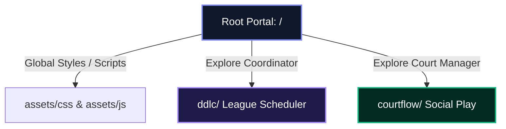

# Master Architecture Documentation

This document establishes the structural rules, domain boundaries, and technical history of the FixtureFlow brand portal and marketing monorepo.

---

## 🧭 1. Repository Domain Taxonomy

This repository operates as a multi-domain portal split into distinct directory roles:

*   **Root Namespace (`/`):** Serves as the brand landing portal and traffic router. No waitlist or forms live here.
*   **League Coordinator Namespace (`/ddlc/`):** Hosts the marketing representation and captain portals for league scheduling automation.
*   **Court Queue Manager Namespace (`/courtflow/`):** Hosts the social play matchmaker simulator and user queue management landing pages.
*   **Shared Assets (`/assets/`):** Houses the global CSS tokens (`/assets/css/style.css`) and shared state scripts (`/assets/js/script.js`).

---

## 🎨 2. Design Stance (Sovereign Glassmorphism)

The visual design language is anchored in the following rules:
*   **Fonts:** Display typography uses `Outfit` (heavyweight display headings) paired with `Inter` (neutral body/interface grids).
*   **Atmosphere:** Obsidian dark mode default with translucent cards (`backdrop-filter: blur(16px)`), low-opacity thin borders (`rgba(255, 255, 255, 0.08)`), and soft radial neon color meshes.

### Color Mapping Scope
To visually separate sub-products while maintaining structural layout harmony, we use scoped CSS variable overrides:

*   **Global / League Scheduler Default:** Indigo theme accent (`#a78bfa`).
*   **Court Queue Manager Override:** Emerald green accent (`#10b981`). Repaints buttons, icons, and focus outlines dynamically.

---

## 🛡️ 3. Architectural Decisions (ADRs)

### 📜 ADR-01: Isolated `/ddlc/` Codebase
*   **Stance:** The codebase inside the `/ddlc/` subdirectory must remain completely untouched by root-level style refactors.
*   **Rationale:** To guarantee zero style or scripting regressions for the highly polished, active League Coordinator landing page.
*   **Execution:** `/ddlc/index.html` preserves its local link imports and local `assets/` relative path setups.

### 📜 ADR-02: Client-Side Simulator Sandbox
*   **Stance:** The interactive matchmaker sandbox on the CourtFlow landing page must run entirely client-side.
*   **Rationale:** Demonstrates the rotation solver utility instantly to visitors without requiring account setup or server calls.
*   **Execution:** Employs a local array-matching algorithm mimicking the production `clubflow-lib` matching heuristics. Capped at 4 rounds to incentivize waitlist signup.

---

## 🔄 4. Cross-Page State Persistence (Theme Synchronizer)

*   **Persistence Store:** Local state is saved to the browser's `localStorage` under the key `theme`.
*   **Dynamic Schedules:** In the absence of a manual toggle lock in `localStorage`, the script query checks OS preferences (`prefers-color-scheme`) and defaults to Dark Mode between 7 PM and 7 AM local time.
*   **Cross-Domain inheritance:** Because `/`, `/ddlc/`, and `/courtflow/` run under the same origin domain (`fixtureflow.github.io`), the `localStorage` overrides are automatically visible to all subpages. Toggling dark/light mode on the homepage instantly repaints the other portals on navigation.
