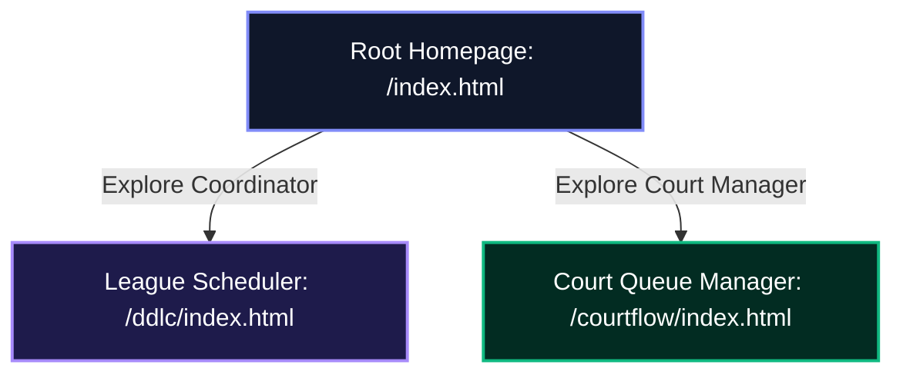
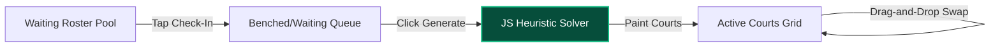

# FixtureFlow Workspace Redesign Plan

This plan outlines the steps, architecture, and layouts to elevate the parent homepage (`/index.html`) and the **CourtFlow** product page (`/courtflow/index.html`) to the same premium visual standard as the **League Coordinator** (`/ddlc/`) portal, while ensuring zero regressions to `/ddlc/`.

---

## 🎨 1. Theme & Design Tokens (Sovereign Glassmorphism)

To maintain absolute consistency across the brand, the root homepage and the CourtFlow page will share the design tokens defined in `/ddlc/style.css` without modifying the `/ddlc/` directory.

### Shared CSS (`/assets/css/style.css`)
We will extract and establish a global `/assets/css/style.css` file containing:
*   **Fonts:** `Outfit` (for display/headers) and `Inter` (for readable interface grids).
*   **Aesthetic Classes:** `.glass-panel` backdrop filters, `.btn` hover transitions, custom scrollbars, and keyframes for entrance animations.
*   **Dual Theme Configurations:**
    *   **Light Mode:** Soft slate backgrounds (`#f8fafc`), dark slate headers (`#0f172a`), and low-opacity borders (`rgba(15, 23, 42, 0.05)`).
    *   **Dark Mode:** Dark obsidian space (`#08090d`), muted silver texts (`#94a3b8`), and thin glass borders (`rgba(255, 255, 255, 0.08)`).

### Theme & Color Settings
To visually segregate the products while keeping the layouts consistent, we will use separate color schemes:

| Page / Sub-Platform | Dominant Color | Color Accent | Accent Glow Code |
| :--- | :--- | :--- | :--- |
| **Root Homepage (`/`)** | Obsidian Dark (`#08090d`) | Indigo-to-Emerald Gradient | `linear-gradient(135deg, #a78bfa, #10b981)` |
| **ddlc Portal (`/ddlc/`)** | Obsidian Dark (`#08090d`) | Electric Indigo (`#a78bfa`) | `rgba(167, 139, 250, 0.25)` |
| **CourtFlow Portal (`/courtflow/`)** | Obsidian Dark (`#08090d`) | Neon Mint (`#10b981`) | `rgba(16, 185, 129, 0.15)` |

---

## 🧭 2. Page Information Architecture & Layouts



### 2.1. The Root Homepage (`/index.html`) Redesign
*   **Role:** Unified company/brand portal and traffic router.
*   **Navigation Header:** Glassmorphic navigation panel containing the `FixtureFlow` logo, links to *League Coordinator* and *Court Manager*, and the universal theme toggle.
*   **Hero Section:** 
    *   Title: *"Autopilot your racket sports club operations."*
    *   Tagline: *"Next-generation automation for Match Secretaries and Club Organizers."*
    *   Background: Two overlapping radial blurred gradients (Indigo on the left, Emerald Green on the right).
*   **The Ecosystem Split (Side-by-Side Cards):**
    *   Instead of plain text list blocks, we will use two visual glass panels:
        *   **Left Column (League Coordinator):** Focuses on schedule bookings, captain team sheets, and unavailability grids. Action button: *“Explore League Coordinator”* $\rightarrow$ `/ddlc/`.
        *   **Right Column (Social Queue manager):** Focuses on skill pairing calculations, gender balance guards, and waiting bench priority. Action button: *“Explore Social Queue Manager”* $\rightarrow$ `/courtflow/`.
    *   No waitlist capture form will be present on this page to maximize visual focus and reduce generic brand clutter.

### 2.2. The CourtFlow Landing Page (`/courtflow/index.html`)
*   **Role:** Targeted presentation and interactive demo page for social play queue automation.
*   **Hero Section:** Focuses on freeing match organizers from whiteboards, pens, and constant player rotation complaints.
*   **Waitlist Ingestion Form:** Premium waitlist input connected to the Google Apps Script Web App CRM.

---

## 🎮 3. CourtFlow Live Interactive Sandbox

To provide prospective clubs with a first-hand demonstration of the matchmaker, we will build a client-side **social play simulator** directly into the `/courtflow/` landing page.



### Technical Implementation Spec:
1.  **Mock Data Injection:**
    Prepopulate a local JSON array with 14 mock players (mix of genders and skills from 1 to 5).
2.  **Roster Check-In Component:**
    Render interactive player chips. Tapping toggles their state from checked-out (grey) to checked-in (green/waiting queue).
3.  **The Generation Engine:**
    Compile a simplified JavaScript implementation of the actual `clubflow-lib/Portal_Main_JS_Engine.html` rotation algorithm:
    *   Calculates court assignments by pairing players based on skill parity.
    *   Maintains a FIFO history queue to prevent repeating the same partners/opponents.
    *   Sorts benched waiting lists chronologically based on benched round count.
4.  **Drag-and-Drop Interactivity:**
    Include HTML5 drag-and-drop bindings allowing users to drag player chips off court slots to swap them manually, updating the court averages instantly.
5.  **Round Counter & Call-to-Action Modal:**
    Allow the visitor to click "Generate Next Round" up to 4 times. On the 5th attempt, trigger a smooth modal window disabling the buttons and displaying a prompt to subscribe to the waitlist.

---

## 🛡️ 4. Integration & State Persistence

### Theme Synchronization Policy
We will deploy a shared Javascript theme controller at `/assets/js/script.js` to manage lighting styles dynamically across all pages:
*   Checking the visitor's manual overrides in `localStorage`.
*   Falling back to system preferences or local time (7 PM - 7 AM Dark theme default).
*   **Cross-Page Sync:** When a user toggles the theme on the homepage, it saves to `localStorage`. When they click *Explore Coordinator*, `/ddlc/index.html`'s theme controller reads this variable and applies the dark/light style instantly, ensuring a seamless visual transition.

### Zero-Regression Safety Net
*   **Untouched `/ddlc/` Code:** The files inside the `/ddlc/` directory (HTML, CSS, JS) will remain completely untouched. This guarantees that any stylesheet overrides, scriptlet comments, or layout structures in `/ddlc/` are 100% immune to regressions.
*   **Local Assets Mapping:** All shared variables, fonts, and assets will load from shared paths (`/assets/css/style.css`, `/assets/js/script.js`), while product-specific overrides load from `/courtflow/style.css`.

---

## 📱 5. Mobile-First UX & Accessibility Spec (Fitts' Law & WCAG)

*   **Min Touch Targets:** All interactive chips, month selectors, and buttons must have a minimum physical size of `48px` by `48px` (or `44pt` on iOS) to prevent accidental taps and support one-handed usage.
*   **Mobile Thumb Zones:** Primary action buttons (such as the waitlist submit button and the sandbox generate trigger) will live in the lower middle third of the screen to respect mobile ergonomics.
*   **Keyboard Interactivity:** All button elements and links will use visible `:focus-visible` focus indicators (a bright accent outline) to support standard accessibility tab navigation.
*   **Aria Landmarks & Labels:** Icon-only triggers (like the theme toggle button) must have explicit `aria-label` tags (e.g., `aria-label="Toggle Light/Dark Theme"`) for screen readers.

---

## 🔍 6. SEO, Meta, and JSON-LD Structured Data

*   **Custom Page Headers:**
    *   **Homepage:** Title: `FixtureFlow | Racket Sports Club Management Solutions`. Meta Description: `Automate league coordinator scheduling and social play court rotations on autopilot. Powered by Google Sheets.`
    *   **CourtFlow:** Title: `CourtFlow | Social Play & Court Queue Autopilot`. Meta Description: `Autopilot busy badminton social nights. Automated court queues, skill-based doubles pairing solvers, and player rotation.`
*   **OpenGraph Previews:** Provide standard OpenGraph headers on all pages containing title, canonical URL, and pointing to `/ddlc/assets/card-fixtureflow.png` to guarantee high-quality previews when links are shared on LinkedIn.
*   **Structured Schema:** Inject a JSON-LD structured schema script in the header of `/index.html` to help search engines catalog the application entity:
    ```html
    <script type="application/ld+json">
    {
      "@context": "https://schema.org",
      "@type": "SoftwareApplication",
      "name": "FixtureFlow",
      "operatingSystem": "All",
      "applicationCategory": "BusinessApplication",
      "offers": {
        "@type": "Offer",
        "price": "0",
        "priceCurrency": "USD"
      }
    }
    </script>
    ```

### 6.1. Multi-Platform Favicon & Touch Icon Specs
To ensure complete portability and prevent layout/rendering glitches across browsers and operating systems, we standardize on the following asset formats:
*   **`favicon.svg` (Optimized Vector):** Modern browser tab icon featuring centered typography and negative letter-spacing for sharp micro-rendering.
*   **`favicon.ico` (Multi-Resolution Fallback):** Contains $16\text{px} \times 16\text{px}$, $32\text{px} \times 32\text{px}$, and $48\text{px} \times 48\text{px}$ raster dimensions in a single file to support legacy browsers.
*   **`apple-touch-icon.png` ($180\text{px} \times 180\text{px}$):** Solid-background (non-transparent) raster PNG. iOS Safari home screen bookmarks do not support transparency (which causes black margins).
*   **`safari-pinned-tab.svg` (Monochrome Mask):** A flat, single-color black silhouette vector icon representing the "FF" letters. Used for macOS Safari pinned tabs, styled with the `color="#10b981"` attribute.

**HTML Integration Layout:**
```html
<link rel="icon" type="image/svg+xml" href="/favicon.svg">
<link rel="icon" type="image/x-icon" href="/favicon.ico" sizes="any">
<link rel="apple-touch-icon" sizes="180x180" href="/apple-touch-icon.png">
<link rel="mask-icon" href="/safari-pinned-tab.svg" color="#10b981">
```

### 6.2. Favicon Stress-Test Checklist
Before releasing pages, verify that all target icons display cleanly under different browser conditions:
*   [ ] **Light Theme Tab Test:** Check `favicon.svg` rendering against a light tab background (`#ffffff` or `#f1f5f9`).
*   [ ] **Dark Theme Tab Test:** Check `favicon.svg` rendering against a dark tab background (`#000` or `#1e1e1e`).
*   [ ] **iOS Bookmark Test:** Verify `apple-touch-icon.png` renders on an iOS device home screen without black background borders.
*   [ ] **Safari Pin Test:** Verify `safari-pinned-tab.svg` renders as a clean monochrome silhouette on a macOS Safari pinned tab.

---

## 🎨 7. Design Stance & Feasibility (DFII Scorecard)

*   **Aesthetic Direction:** *Sovereign SaaS Glassmorphism* (Obsidian dark space with translucent glass panels, Outfit display typography, and neon accents).
*   **Differentiation Anchor:** The live client-side Court Queue Matchmaker simulator that allows users to interact and run pairings in their browser without registering.
*   **DFII Scorecard Audit:**
    *   *Aesthetic Impact:* `5/5` (Gradient meshes, interactive simulator, customized Outfit display font).
    *   *Context Fit:* `5/5` (Matches tech-savvy club managers and match secretaries).
    *   *Implementation Feasibility:* `5/5` (Uses vanilla JS and CSS, zero third-party packages).
    *   *Performance Safety:* `4/5` (GPU-accelerated transformations, lightweight local array sorting).
    *   *Consistency Risk:* `-1` (Mitigated by leaving the `/ddlc/` codebase 100% untouched).
    *   **Total DFII Score:** **+18** (Outstanding, execute fully).

---

## 📝 8. The Website Documentation Trinity

We will establish a dedicated `docs/` workspace standard in this repository to prevent context drift and guide future developers and AI agents:

1.  **`docs/architecture/MASTER_ARCHITECTURE.md`:** 
    Documents file taxonomy, design stance tokens, cross-page state sharing mechanics, and the safety boundary rules protecting `/ddlc/` from regression.
2.  **`docs/user_guides/INSTRUCTION_MANUAL.md`:**
    Provides API webhook specifications, setup operations for running local static preview servers, and a step-by-step product page addition guide.
3.  **`docs/architecture/CODEBASE_MAP.md`:**
    A collapsible high-density layout index mapping endpoints and files.
4.  **`scripts/build_codebase_map.py`:**
    We will build a local python indexing script bound to `npm run doc-sync` to auto-compile the codebase map dynamically.

---

## 🚀 9. Phase-by-Phase Implementation Roadmap

We will execute this redesign sequentially to maintain stability and ensure zero regressions at each milestone:

### 🏁 Phase 1: Shared Core & Assets Foundation
*   [x] **1.1. Create shared `/assets/css/style.css`:** Declare CSS resets, import Outfit/Inter google fonts, establish light/dark custom variables, and define glass panel classes.
*   [x] **1.2. Create shared `/assets/js/script.js`:** Implement theme observer checking localStorage, prefers-color-scheme system queries, and automatic background time locks.
*   [x] **1.3. Binds headers:** Link root `/index.html` and `/courtflow/index.html` headers to shared styles and scripts.

### 🏠 Phase 2: Root Homepage Portal Redesign
*   [x] **2.1. Navigation Bar:** Build sticky glassmorphic navigation header featuring the Outfit brand logo and light/dark theme switch.
*   [x] **2.2. Hero Section:** Build primary title visual with radial backdrop color glow meshes.
*   [x] **2.3. The Product Split Columns:** Implement the side-by-side showcase cards directing traffic to `/ddlc/` and `/courtflow/`.
*   [x] **2.4. Mobile Optimization:** Ensure the page is responsive down to $375\text{px}$ without horizontal scroll breakages.

### 🏸 Phase 3: CourtFlow Product Page & Simulator
*   [x] **3.1. Layout & Theme:** Rebuild `/courtflow/index.html` using the global `/style.css` and the emerald green overrides.
*   [x] **3.2. Mock Queue Solver:** Implement benched FIFO waiting list logic and skill-based pairing loops in client JavaScript.
*   [x] **3.3. Interactive Grid Visual:** Draw benched player chips and active court cards supporting drag-and-drop overrides.
*   [x] **3.4. Waitlist CRM Form:** Connect lead collection form to GAS webhook endpoint.
*   [x] **3.5. 4-Round Gate Overlay:** Block sandbox execution on 5th match round and prompt registration.

### 🛡️ Phase 4: SEO, Schema, and A11y Verification
*   [x] **4.1. Metadata:** Add title, descriptions, and OpenGraph variables.
*   [x] **4.2. Schema:** Inject the JSON-LD `SoftwareApplication` markup inside `/index.html` header.
*   [x] **4.3. Accessibility Checks:** Verify WCAG color contrast matches $\ge 4.5:1$ ratio and focus borders are visible.

### 📚 Phase 5: Self-Healing Website Documentation Trinity
*   [x] **5.1. Master Architecture:** Create `docs/architecture/MASTER_ARCHITECTURE.md`.
*   [x] **5.2. Instruction Manual:** Create `docs/user_guides/INSTRUCTION_MANUAL.md`.
*   [x] **5.3. Map Sync Script:** Implement `scripts/build_codebase_map.py` and map `npm run doc-sync` (optional Python runner setup).
*   [x] **5.4. Indexing:** Run map sync script to generate dynamic index `docs/architecture/CODEBASE_MAP.md`.


